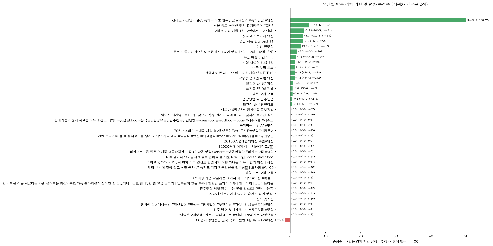

# 유튜브 맛집 영상 댓글을 통해 '찐 밧집'인지 검증하기!
# 20221266 전시훈

## 주제 선정 이유

저는 지역 맛집을 찾을때 유튜브에 올라온 지역의 맛집영상을 검색 해보곤 합니다. 하지만 유튜버의 주관적인 입맛이 다르기 때문에 저는 영상만 보는것이 아닌 댓글을 함께봐 이곳이 찐 맛집인지 아닌지 자체 검증을 합니다. 하지만 유튜브 영상에는 무수히 많은 댓글이 있고 이 댓글들 의 의견 마저 다릅니다. 보통 맛집 영상 - 댓글 - 맛집이라고 인정하는 댓글의 수 이런 순서로 맛집임을 확인하는데 보통 상단에 있는 댓글만 확인하기 때문에 이 맛집에 대한 댓글이 긍정이 많은지 부정이 많은지 정확한 수치를 알 수 없었습니다. 그렇기 때문에 유튜브 맛집 영상 댓글을 분석하여 맛집 점수(긍정댓글은 + , 부정 댓글은 - )에 따른 '찐 맛집' 영상인지 확인하는 모델링을 구축하게 되었습니다.

## 1. 연구 질문과 해석 범위

고정 등록 영상과 YouTube에서 검색한 `맛집` 관련도 상위 영상의 댓글을 분석해 영상별 댓글 감성과, 실제 방문 경험 및 맛 평가를 함께 언급한 댓글의 방향을 살펴보았습니다. 여러 맛집을 추천하는 영상에서는 댓글을 보고 맛집인지 특정하기 어려웠습니다. 추가로 이 모델링을 통해 계산된 점수는 맛집 점수라기 보다는 영상댓글의 반응 추정치라고 부르는것이 정확한것 같습니다.(긍정/ 부정 추정치)

## 2. 영상 검색과 댓글 수집

기존 영상 14개와 YouTube Data API v3에서 검색한 `맛집` 관련도 상위 30개를 결합하였습니다.
검색 조건은 `regionCode=KR`,`relevanceLanguage=ko`, `order=relevance' 이고, 검색 결과 중 기존 영상과 중복인 4개를 제외해 신규 26개를 추가했으며, 총 40개 영상에서 댓글을 수집했습니다.
| 항목 | 결과 |
|---|---:|
| 고정 등록 영상 | 14 |
| 검색 결과 | 30 |
| 기존 영상과 검색 중복 | 4 |
| 새로 추가된 영상 | 26 |
| 전체 수집 대상 | 40 |
| API 댓글 수집 | 6,904 |
| 전처리 후 분석 댓글 | 6,570 |
| 전처리에서 제외 | 334 |
| API 오류 | 0 |

영상당 최신순 최상위 댓글을 최대 500개까지 수집했고 답글은 제외했습니다.

## 3. 전체 댓글 감성

전처리 후 6,570개 댓글을 규칙 기반으로 긍정·중립·부정 분류하였습니다.
이 분류는 댓글의 감성 표현을 추정하며, 음식점 자체를 평가한 것이 아닙니다.

| 자동 분류 감성 | 댓글 수 | 전체 분석 댓글 대비 |
|---|---:|---:|
| 긍정 | 1,394 | 21.22% |
| 중립 | 4,957 | 75.45% |
| 부정 | 219 | 3.33% |
| **합계** | **6,570** | **100%** |

## 4. 방문 경험 기반 맛 평가 점수

사용자가 제안한 방식에 따라, 댓글에서 방문 경험을 나타내는 표현과 명시적인 맛 평가를 함께 찾았습니다.
예를 들어 “먹어봤는데 맛있어요”, “나 여기 맛있었음”은 긍정 후보, “여기 실제로 별로임”은 부정 후보로 처리하고,
“맛있어 보여서 가보고 싶다”처럼 기대만 표현한 댓글은 방문 평가로 넣지 않았습니다.

### 계산 방법

- 방문 경험과 긍정 맛 평가가 포착된 댓글: **+1점**
- 방문 경험과 부정 맛 평가가 포착된 댓글: **−1점**
- 방문/맛 평가가 없거나, 기대 표현·혼합 평가인 댓글: **0점**
- 각 비율과 점수의 분모: 해당 영상에서 전처리 후 분석한 **전체 댓글 수**
- 순점수: **(긍정 평가 댓글 수 − 부정 평가 댓글 수) / 전체 분석 댓글 수 × 100**

따라서 순점수는 −100~+100 범위입니다.
점수 0은 긍정과 부정이 같거나, 점수에 반영할 수 있는 명시적 방문·맛 평가가 없다는 뜻입니다.

### 전체 결과

| 항목 | 댓글 수 | 전체 6,570개 대비 |
|---|---:|---:|
| 자동 포착 긍정 방문·맛 평가 | 116 | 1.77% |
| 자동 포착 부정 방문·맛 평가 | 23 | 0.35% |
| 점수 미반영 댓글 | 6,431 | 97.88% |
| **순점수** | **긍정 116 − 부정 23 = +93** | **+1.42점** |

즉, 분석 댓글 100개당 긍정적인 방문·맛 평가 표현은 약 1.77개, 부정적인 표현은 약 0.35개가 자동 포착됐고, 차이는 100개당 약 +1.42개 였습니다. 전체 댓글의 다수는 방문 경험을 명시하지 않거나 맛에 대한 직접 평가가 없어 0점으로 남았습니다.

예를 들어 “맛집 웨이팅 전국 1위 맛있어서가 아니다!” 영상은 분석 댓글 491개 중 긍정 24개, 부정 5개가 포착되어 순점수 +3.87입니다. 삿포로 스프카레 영상은 459개 중 긍정 20개, 부정 3개로 +3.70입니다.
인천 찐맛집 영상은 487개 중 긍정 15개, 부정 0개로 +3.08입니다.
반면 “80년째 영업중인 전국 육회비빔밥” 영상은 64개 중 부정 평가만 1개 포착되어 −1.56입니다.
이처럼 맛집 홍보 영상이지만 부정 댓글이 더 많이 달리는 영상을 구분할 수 있습니다.

댓글이 2개인 영상의 +50처럼 분모가 작은 경우 점수가 크게 흔들리므로, **점수와 함께 댓글 수 및 실제 평가 건수**를 봐야 합니다. 영상 목록형 콘텐츠에서는 댓글이 영상 속 어느 음식점을 말하는지도 확인되지 않을 수 있습니다.

## 5. 토픽 분석과 튜닝

다국어 Sentence Transformer 임베딩과 BERTopic을 사용해 UMAP·HDBSCAN 설정을 다섯 가지로 비교했습니다.

| 설정 | 토픽 수 | 노이즈 비율 | 최대 토픽 댓글 | 코사인 실루엣 |
|---|---:|---:|---:|---:|
| baseline | 12 | 2.15% | 5,882 | -0.270 |
| neighbors_30 | 3 | 0.09% | 6,340 | -0.134 |
| components_10 | 4 | 0.00% | 5,894 | -0.079 |
| cluster_size_40 | 6 | 1.61% | 5,882 | -0.238 |
| samples_10 | 9 | 1.87% | 5,878 | -0.262 |

토픽 개수는 2~12개로 달라졌지만, 각 실험에서 가장 큰 토픽이 전체 댓글 대부분을 차지했다. 실루엣도 모두 음수여서 토픽 간 경계가 뚜렷하다고 볼 수 없어서  토픽명은 댓글 내용의 탐색적 요약으로만 해석했습니다.

## 6. 결론과 한계

1. 전체 분석 댓글 중 자동 포착된 방문 경험 기반 긍정 맛 평가는 1.77%, 부정 평가는 0.35%였고, 전체 댓글 대비 순점수는 **+1.42점**
2. 이 점수는 방문·맛 표현을 찾는 규칙의 자동 결과다. 댓글 작성자의 실제 방문, 문맥, 댓글이 가리키는 가게를 사람이 확인한 결과가 아니라고 생각함
3. 점수 미반영 댓글이 97.88%이며, 작은 댓글 표본의 점수는 크게 변동할 수 있다는 결과를 얻음.
4. YouTube 검색 결과는 관련도순이며, 모든 검색 영상이 한 식당에 대한 평가 영상은 아니다. 한 영상이 여러 식당을 다룰 수도 있음.
5. 댓글 작성자는 전체 방문객이나 시청자의 무작위 표본이 아니며, 영상당 최신 댓글을 최대 500개까지만 수집함.
6. 토픽 결과도 큰 군집에 댓글이 집중되어 세밀한 주제 구분과 확정적 해석에는 한계가 있다는 결론을 도출함.

**결론:** 점수제로 댓글의 방향을 요약하는 것은 가능하고, 이 분석에서는 자동 포착된 방문·맛 평가 댓글의 순점수가 전체 댓글 100개당 약 **+1.42**이며, 이는 댓글에 긍정 표현이 부정 표현보다 더 많이 포착됐다는 뜻일 뿐, 모든 추천 식당이 “찐 맛집”이라는 증거는 아니다.
하지만 유튜브 맛집 영상을 보고 가볼까? 라고 고민이 드는 사람이 있다면 긍정 댓글이 부정 댓글보다 많은 맛집을 가는것을 추천한다.